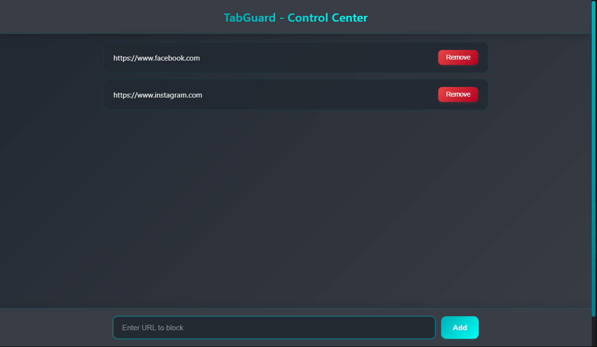

# TabGuard - Website Blocker Extension

A sleek and efficient Chrome extension that helps you block distracting websites and stay focused. With TabGuard, you can easily manage your blocked sites list and prevent access to time-wasting websites.

 

## Features

- 🛡️ **Easy Blocking**: Add websites to your block list with one click
- 🗑️ **Simple Removal**: Remove sites from your block list when needed
- 🎨 **Modern UI**: Clean, interface with smooth animations
- ⚡ **Instant Blocking**: Sites are blocked immediately after adding
- 🔄 **Sync Support**: Block lists persist across browser sessions

## Installation

1. Clone this repository or download the ZIP file
2. Open Chrome and navigate to `chrome://extensions/`
3. Enable "Developer mode" (toggle in top right corner)
4. Click "Load unpacked" and select the extension folder

## Usage

1. Click the TabGuard extension icon in your toolbar
2. Add websites by entering their URLs in the input field
3. Remove websites by clicking the "Remove" button next to any entry
4. Blocked sites will show an error page when accessed

## Screenshots

_The TabGuard control center with blocked sites list_

## How It Works

TabGuard uses Chrome's `declarativeNetRequest` API to block websites at the network level. This approach:

- Works without requiring permission to read your browsing data
- Is more efficient than content script-based blocking
- Provides immediate blocking without page reloads

### File Structure

- `background.js` - Extension service worker and blocking logic
- `options.js` - Options page functionality
- `options.html` - Options page markup
- `options.css` - Styling for the options page
- `icons/` - Extension icons in various sizes

## License

MIT License - See [LICENSE](LICENSE) for details.
